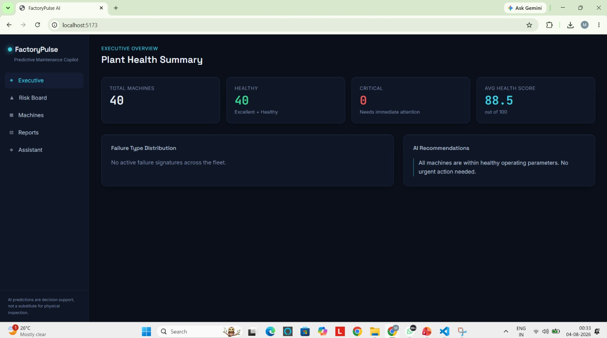

# FactoryPulse AI

AI Copilot for Sustainable Manufacturing.
It predicts machine failures before they happen, explains *why* in plain
language, and tells a plant manager what to do about it — built on top of the
[AI4I 2020 Predictive Maintenance dataset](https://archive.ics.uci.edu/dataset/601/ai4i+2020+predictive+maintenance+dataset).

```
Sensor readings → ML models → Health score & risk → AI explanations → Dashboard & Chat
```
<p align="center">
  
</p>
## Features

| # | Feature | Where it lives |
|---|---|---|
| 1 | Machine failure prediction (XGBoost) | `ml/train.py`, `backend/app/services/ml_predictor.py` |
| 2 | Failure type prediction (HDF / PWF / OSF / TWF / RNF) | same |
| 3 | Machine health score (0–100, banded) | `backend/app/services/health_score.py` |
| 4 | Risk dashboard (healthy/warning/critical, trend, distribution) | `/risk` page |
| 5 | AI maintenance assistant (Gemini + rule-based fallback) | `backend/app/services/explanation.py` |
| 6 | Automatic maintenance report | `/reports` page |
| 7 | AI chat assistant | `/chat` page |
| 8 | Executive dashboard | `/` page |
| — | Anomaly detection (Isolation Forest) | `ml/train.py` |

## Architecture & why it's structured this way

The backend follows SOLID on purpose, not as decoration:

- **Single Responsibility** — each service does one job: `MLPredictionService`
  only runs models, `HealthScoreService` only turns probabilities into a
  score, `RecommendationService` only decides priority + action text,
  `ExplanationService` only writes prose.
- **Open/Closed** — `IExplanationService` has two implementations
  (`GeminiExplanationService`, `RuleBasedExplanationService`). Adding a third
  provider (e.g. Claude, OpenAI) means writing a new class, not editing
  existing ones.
- **Liskov Substitution** — anything depending on `IExplanationService` or
  `ISnapshotRepository` works identically regardless of which concrete class
  is injected.
- **Interface Segregation** — repository interfaces expose only what
  consumers need (`IMachineRepository` vs `ISnapshotRepository`), not one
  giant `IDatabase` blob.
- **Dependency Inversion** — routers depend on interfaces (`IMLPredictionService`,
  `IExplanationService`...), never concrete classes. Everything is wired in
  one place: `backend/app/api/deps.py`.

```
backend/app/
├── domain/        # framework-free entities & enums — the business vocabulary
├── schemas/       # Pydantic request/response models
├── orm/           # SQLAlchemy models (Machine, MachineSnapshot)
├── repositories/  # interfaces + SQLAlchemy implementations
├── services/      # ML prediction, health score, recommendations,
│                  # explanations, chat, reports, dashboard aggregation, seeding
└── api/
    ├── deps.py           # composition root — wires interfaces to implementations
    └── routers/          # thin HTTP layer, no business logic
```

## Model performance (on the bundled dataset)

Trained via `ml/train.py` on `ai4i2020.csv` (10,000 rows, 80/20 split):

- **Failure predictor (XGBoost)**: ROC-AUC **0.98**, F1 **0.83**
- **Failure type classifier (XGBoost, multiclass)**: macro-F1 **0.61**
  (the rarer failure modes — TWF, RNF — have very few positive examples in
  this dataset, which is a known characteristic of AI4I 2020, not a bug)
- **Anomaly detector**: Isolation Forest, 5% contamination, unsupervised

Full metrics are written to `ml/models/metadata.json` after training.

## Running it locally

### Option A — Docker Compose (recommended)

```bash
docker compose up --build
```

- Backend: http://localhost:8000 (docs at `/docs`)
- Frontend: http://localhost:5173

The backend auto-seeds the database from `ai4i2020.csv` on first boot (~40
synthetic machines, 4,000 simulated readings) so the dashboard isn't empty.

### Option B — Run each piece manually

**1. Train the models** (only needed if you want to retrain; pretrained
artifacts already ship in `backend/app/ml_models/`):

```bash
cd ml
pip install -r requirements.txt
python train.py --data data/ai4i2020.csv --out models/
```

**2. Backend**

```bash
cd backend
cp .env.example .env       # edit DATABASE_URL / GEMINI_API_KEY if desired
pip install -r requirements.txt
uvicorn app.main:app --reload
```

**3. Frontend**

```bash
cd frontend
cp .env.example .env       # points at http://localhost:8000/api by default
npm install
npm run dev
```

### Enabling Gemini explanations

Without a `GEMINI_API_KEY`, the AI Assistant and Chat Assistant use a
deterministic rule-based explanation engine — the app is fully functional
with zero external API calls. To get natural-language Gemini explanations
instead, set `GEMINI_API_KEY` in `backend/.env` (get a key at
[aistudio.google.com](https://aistudio.google.com/apikey)). If a Gemini call
ever fails (rate limit, network), the backend transparently falls back to the
rule-based engine — the UI never breaks.

## Deployment

**Backend → Render**
1. New Web Service, point at `backend/`, use the included `Dockerfile`.
2. Add a Render Postgres instance; set `DATABASE_URL` to its connection string.
3. Set `CORS_ORIGINS` to your Vercel frontend URL.
4. Optionally set `GEMINI_API_KEY`.

**Frontend → Vercel**
1. Import `frontend/` as the project root.
2. Framework preset: Vite.
3. Set `VITE_API_BASE_URL` to your Render backend URL + `/api`.

## Tech stack

- **Frontend**: React, Vite, Tailwind CSS, Recharts, React Router
- **Backend**: FastAPI, SQLAlchemy, Pydantic
- **Database**: PostgreSQL (SQLite fallback for local dev — no setup required)
- **ML**: XGBoost (failure + failure-type classifiers), Isolation Forest
  (anomaly detection), scikit-learn (feature engineering)
- **Generative AI**: Gemini API for explanations, with a rule-based fallback
- **Deployment**: Docker Compose locally; Render (backend + DB) + Vercel
  (frontend) in production

## Project layout

```
factorypulse-ai/
├── ml/                  # training pipeline + dataset
├── backend/              # FastAPI app (SOLID-structured) + pretrained models
├── frontend/              # React + Tailwind + Recharts dashboard
├── docker-compose.yml
└── README.md
```
